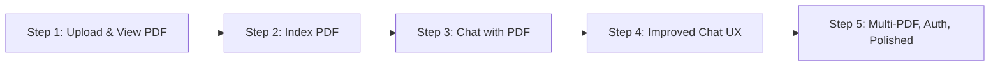

Drawing from the ideas in Henrik Kniberg’s MVP blog post and the “skateboard-to-car” metaphor ([source](https://blog.crisp.se/2016/01/25/henrikkniberg/making-sense-of-mvp)), the goal is to deliver value in each step, ensuring every increment is a usable, testable, and feedback-ready slice of the final product. We’ll avoid “delivering a tire” (i.e., a non-usable part) and instead deliver a “skateboard” (a minimal, but end-to-end working version) at each step.

Here’s how we can slice your requirements into evolutionary, user-valuable increments:

---

## Step 1: "Skateboard" – Upload and View PDF (No Indexing/Chat Yet)
**Goal:** Allow the user to upload a PDF and view it in the frontend.  
**Why:** This delivers a full, testable flow: user uploads a file, sees it reflected in the UI, and gets feedback on upload success/failure.  
**Scope:**
- Frontend: Simple upload form, display uploaded PDF (or at least filename/confirmation).
- Backend: Accept PDF upload, store it (e.g., in a temp folder), return success/failure.

---

## Step 2: "Scooter" – Index PDF After Upload (No Chat Yet)
**Goal:** After upload, index the PDF using the `aimakerspace` library and confirm indexing to the user.  
**Why:** Now, the user not only uploads but also gets confirmation that the PDF is being processed for future use.  
**Scope:**
- Backend: After storing the PDF, run indexing using `aimakerspace` and store the index.
- Frontend: Show status of indexing (e.g., “Indexing in progress”, “Indexing complete”).

---

## Step 3: "Bicycle" – Simple Chat with Indexed PDF (Basic RAG)
**Goal:** Allow the user to ask a question about the uploaded PDF and get a response using a basic RAG (Retrieval-Augmented Generation) system.  
**Why:** This is the first end-to-end “chat with your PDF” experience, even if basic.  
**Scope:**
- Frontend: Simple chat UI (input box, display response).
- Backend: Accept question, use `aimakerspace` to retrieve relevant context from the indexed PDF, and return a generated answer.

---

## Step 4: "Motorcycle" – Improve RAG Experience (History, Better UI, Error Handling)
**Goal:** Make the chat more robust and user-friendly.  
**Why:** Now the user can have a more natural conversation, see chat history, and get better feedback/errors.  
**Scope:**
- Frontend: Show chat history, loading indicators, error messages.
- Backend: Handle multiple questions, improve retrieval/generation quality, better error handling.

---

## Step 5: "Car" – Multiple PDFs, User Management, Polished UX
**Goal:** Support multiple PDFs per user, user authentication, and a polished, production-ready experience.  
**Why:** This is the “full car” – a complete, robust, and scalable product.  
**Scope:**
- Frontend: Manage multiple PDFs, user login, polished UI.
- Backend: User authentication, associate PDFs with users, scalable storage/indexing.

---

### Visual Reference

Here’s how this plan maps to the “skateboard-to-car” MVP metaphor:

---

## Why This Approach?
- **Each step is a complete, usable slice**: The user can always do something meaningful at every stage.
- **Early feedback**: We can test, demo, and get feedback after every increment.
- **Low risk**: If priorities change, we always have a working, valuable product.
- **Agile, evolutionary**: We learn and adapt as we go, just like the “skateboard-to-car” approach ([source](https://blog.crisp.se/2016/01/25/henrikkniberg/making-sense-of-mvp)).

---

Would you like to start with Step 1, or adjust the plan further?